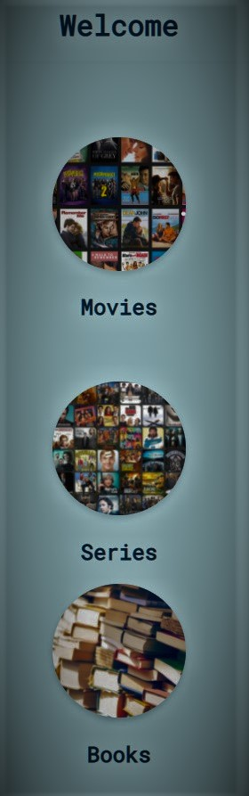

<!DOCTYPE html>
<html>
<head>
	<title>Portfolio</title>
	<link rel="stylesheet" href="styles.css">
	<meta name="viewport" content="width=device-width, initial-scale=1">
	<link href="https://fonts.googleapis.com/css?family=Noto+Sans|Roboto+Mono&display=swap" rel="stylesheet">
</head>
<body>
	
	

		

			
			<h1>Ilze Weldon</h1>
			<h3>Web Developer</h3>
			
Hi! It's nice to meet you.

			

				I’m an energetic IT student with much to learn but will enthusiastically take on new challenges.
				

		

		

		

			

				<h3>My skills</h3>
				<ul class="about-list">
					<li>Communication</li>
					<li>Quick learner</li>
					<li>Flexible</li>
					<li>Good work ethics</li>
					<li>Highly Organized</li>
					<li>People skills</li>
					<li>Multitasking</li>
					<li>Teamwork and support</li>
					<li>Self-motivated</li>

				</ul>
			

			

				<h3>My hobbies</h3>
				<ul class="about-list">
					<li>Reading</li>
					<li>Baking and cooking</li>
					<li>Gaming</li>
					<li>Art and graphic design</li>
					<li>Dunions & Dragons</li>
					
				</ul>
			

		

		

		

			

				<h1>Education</h1>
				<h2>North West Univercity</h2>
				<h3>Bachelor of Science in Information Technology</h3>
				
				
			

			

		

			<h3 class="projects-heading">My Projects</h3>
			

				

					
					
					<h4>GrapDoc</h4>
				

				

					<h4>Nexas Entertainment App</h4>
					
				

				

					<h4>Small Digital art and illistrations app meant for clip art printing designs and stickers </h4>
					
				

				

					<h4>An app meant for keeping track of series,books and movies you need to wach/read, have or are currently watching/reading</h4>
					
				

			

		

		

		

			

				<h3>Links</h3>
				<ul class="links-list">
					<li>
						<a href="https://github.com/Ivy8acupcake">Github</a>
					</li>
					<li>
						<a href="https://app.roll20.net/users/5991069/cupcake">Roll20</a>
					</li>
					<li>
						<a href="https://www.linkedin.com/in/ilze-weldon-b796021a2/">Linkedin</a>
					</li>
					<li>
						<a href="CV project.pdf">Downloadable CV</a>
					</li>
				</ul>
			

			

				<form action="#">
					<label for="email">
						<h4>Email</h4>
						<input type="email" id="email" placeholder="Enter your email" />
					</label>
					<label for="message">
						<h4>Message</h4>
						<textarea id="message" placeholder="Your message"></textarea>
					</label>
					

						<input type="submit" value="Send Message" id="submit-button" />
					

				</form>
			

		

	

	
</body>
</html>
